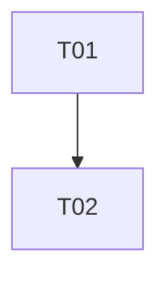

# Ticket index template (write as tickets/README.md)

# Tickets: <slug>

Sprint-sized slices. Markdown only unless the user asked for GitHub issues.

| ID | Title | Size | Depends |
|----|-------|------|---------|
| T01 | … | S | none |

## Dependency graph

## Waves

- Wave 1 (parallel if independent): T01
- Wave 2: T02 (after T01 is implemented)
